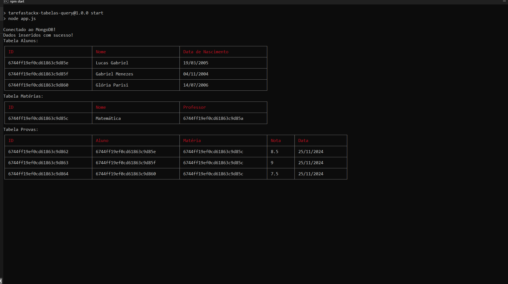

# Tarefa - Gerenciamento Banco de Dados

## Índice

- [Objetivo](#-objetivo)
- [Documentação](#-documentação-do-projeto)
- [Instalação](#instalação-com-bash)
- [Gerenciamento de Tabelas - Operações de Listar e Deletar](#gerenciamento-de-tabelas---operações-de-listar-e-deletar)
- [Demonstração Código Resumido](#demonstração-código-resumido)
  - [- `models/User.js`](#--modelsuserjs)
  - [- `database.js`](#--databasejs)
  - [- `index.js`](#--indexjs)

## 🌟 Objetivo:

### 🎯 Veja essa tabela e escreva a query pedida no fim:

Tabela - provas
📍Colunas:
📍 id_aluno - número
📍 id_materia - número
📍 nota - número flutuante
📍 data_da_prova data

Tabela - aluno
📍 colunas:
📍 id numero
📍 nome string
📍 data_nascimento numero

Tabela - professor
📍 colunas:
📍 id numero
📍 nome string
📍 data_nascimento numero

Tabela - materia
📍 colunas:
📍 id numero
📍 nome string
📍 id_professor numero

🎯 Crie 3 alunos;
🎯 Crie uma matéria e um professor;
🎯 Crie 1 prova para cada aluno nessa matéria e diga que nota eles tiraram.

## 📖 Documentação do Projeto

 <div align="center">


[✨ **Clique aqui para saber mais da documentação** ✨](https://github.com/RaizerTechDev/tarefaStackX-tabelas-query/blob/master/Documentation.md)

<br>

<div align="center">
  
 [Demonstração-Tabelas] 



<br>

---

<div align="left">

## Instalação com bash

- Clone o repositório:

```
git clone https://github.com/seu-usuario/nome-do-repositorio.git
```

- Navegue até o diretório do projeto:

```
cd nome-do-repositorio
```

- Instale as dependências:

```
npm install dotenv mongoose cli-table3
```

<br>

- Inicie o servidor:

```
npm start
```

<br>

- Vai iniciar no terminal a consulta das Tabelas.

---

## Gerenciamento de Tabelas - Operações de Listar e Deletar

Nesta parte do projeto serve para fornecer ferramentas simples para listar e deletar tabelas. Abaixo estão as instruções detalhadas para realizar essas operações.

### Como usar

#### 1. Listar Tabelas:

Para listar todas as tabelas disponíveis no sistema, execute o seguinte comando:

```bash
node src/services/list.js
```

#### 2. Deletar Tabelas:

Para deletar todas as tabelas disponíveis no sistema, execute o seguinte comando:

```bash
node src/services/delete.js
```

---

## Demonstração Código Resumido

#### - `models/Aluno.js`

```javascript
const mongoose = require("mongoose");

const AlunoSchema = new mongoose.Schema({
  nome: { type: String, required: true },
  data_nascimento: { type: Date, required: true },
});

module.exports = mongoose.model("Aluno", AlunoSchema);
```

<br>

#### - `database/index.js`

```javascript
const mongoose = require("mongoose");
require("dotenv").config();

const connectDB = async () => {
  const uri = process.env.MONGODB_URI;

  if (!uri) {
    console.error("Erro: MONGODB_URI não está definido no arquivo .env");
    process.exit(1);
  }

  try {
    await mongoose.connect(uri);
    console.log("Conectado ao MongoDB!");
  } catch (err) {
    console.error("Erro ao conectar ao MongoDB:", err);
    process.exit(1);
  }
};

module.exports = connectDB;
```

<br>

#### - `index.js`

```javascript
const connectDB = require("./src/database");
const seedData = require("./src/seed/seedData");
const Aluno = require("./src/models/Aluno");

const start = async () => {
  await connectDB();
  await seedData();
  await showTables(); // Chama a função para exibir as tabelas
};

start();
```

---

## Tecnologias

 Tecnologias utilizadas no projeto:

- `JavaScript (JS)`
  "Linguagem de Programação do Navegador".
  "Scripting Dinâmico para Web".
  <br>

- `Node.js`
  "Ambiente de Execução JavaScript do Lado do Servidor".
  "Servidor Escalável em JavaScript".
  <br>

- `Documentation.md`
  "Guia detalhado para uso e manutenção do projeto."
  "Referência central para funcionalidades, práticas e requisitos."
  <br>

- `Git`
  "Sistema de controle de versões"
  <br>

- `Github`
  "Plataforma para hospedagem de código-fonte"
  <br>

- `Visual Studio Code`
  "Editor de código-fonte"
  <br>

---

## Licença

- Esse projeto está sob a licença MIT.
  <br>

---

 Autor

<p>
    
    <p>&nbsp&nbsp&nbspRafaelRaizer-Dev<br>
    &nbsp&nbsp&nbsp<a href="https://api.whatsapp.com/send/?phone=47999327137">Whatsapp</a>&nbsp;|&nbsp;<a href="https://www.linkedin.com/in/rafael-raizer//">LinkedIn</a>&nbsp;|&nbsp;<a href="https://github.com/RaizerTechDev">GitHub</a>|&nbsp;<a href="https://public.tableau.com/app/profile/rafael.raizer">Tableau</a>|&nbsp;<a href="https://raizertechdev-portfolio.netlify.app/">Portfólio</a>&nbsp;</p>
</p>
